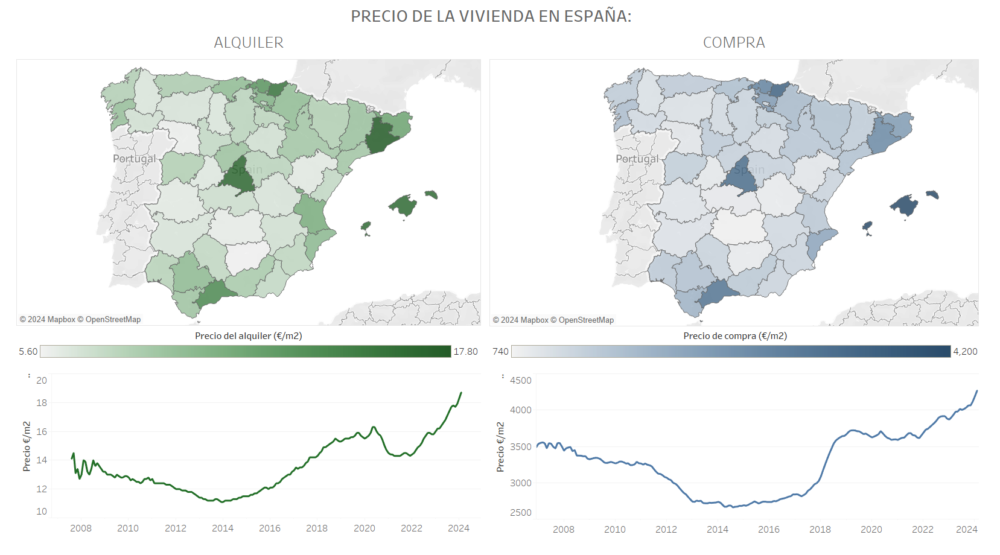
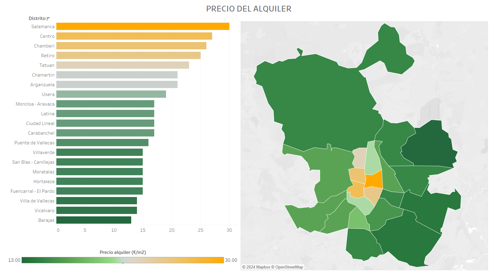
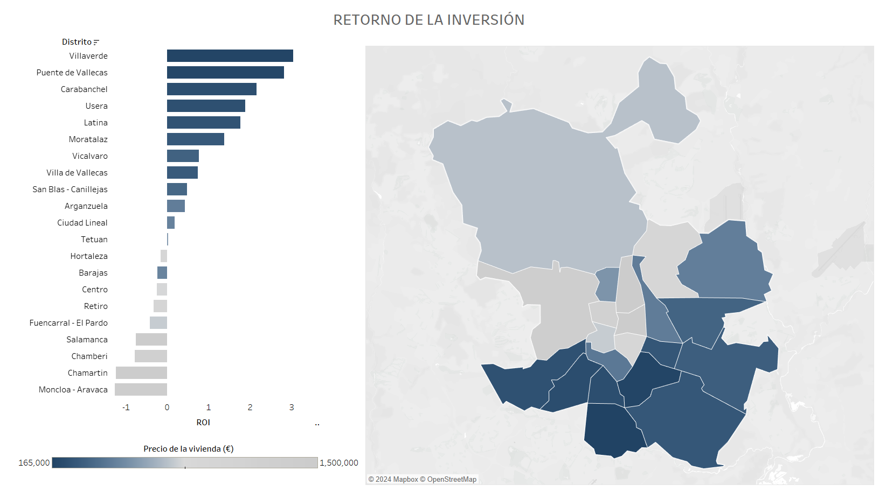
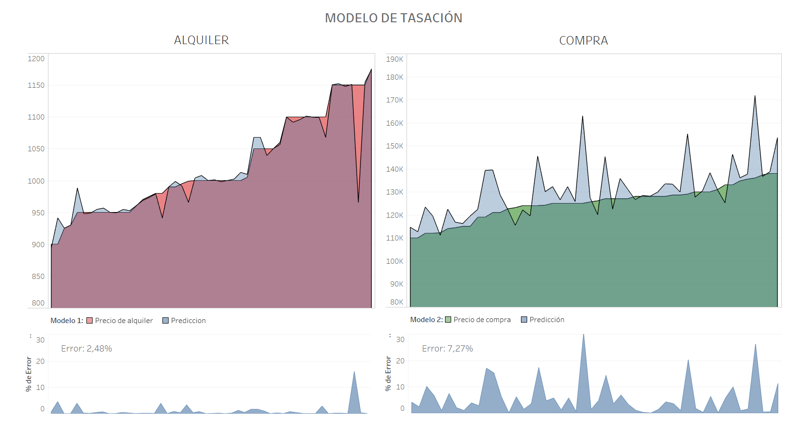

# ANÁLISIS DE LA VIVIENDA EN MADRID: IDEALISTA
## _Proyecto final IRONHACK_

### Programas:
- Jupyter notebook
- Pandas
- Tableau

### Descripción:

- Extracción de datos de la web 'Idealista'
- Análisis exploratorio.
- Modelo de tasación.
- Cálculo del retorno de inversión (ROI) por distrito.

### Proceso:

1. Extracción de datos (web scraping).
2. Limpieza y transformación de los datos para su correcta manipulación posterior (modelo de tasación).
3. Análisis exploratorio: entender los datos y analizar outliers, por zonas y por distritos.
4. Pruebas con distintos modelos de machine learning para encontrar el más adecuado para mi propósito: comprobar si el precio de cada vivienda es adecuado para su entorno y circunstancias.
5. Análisis de cuáles son los distritos más rentables.

 
### Conlusiones:

El screapeo se realizó a principios de marzo de 2024 y extraje casi 36.000 viviendas de segunda mano en venta (entre la zona exterior y la central) y casi 9.000 viviendas en alquiler.

En el proceso de scrapeo web, no ha sido posible extraer todas las características de cada vivienda, principalmente se debe a que un considerable número de usuarios no daban información sobre los detalles de la vivienda, pero aún así, fue suficiente para conseguir un MSE mejor de lo esperado: en cuanto al alquiler, el error fluctuaba entre el 0,69% y el 9,58% con respecto de la media, por ejemplo, en el distrito Latina, para una vivienda en alquiler de 1209€ al mes, el error de predicción estaba en 33,61€ (2,78%).

Por otro lado, en cuanto al cálculo de la rentabilidad (ROI), he hecho un estudio un tanto general y reduccionista, ya que, para su estudio, he considerado el precio medio de la vivienda por distrito y el precio medio del alquiler, también por distrito. He estimado el 7% adicional en gastos de compra de una vivienda de segunda mano y he establecido el 13% de gasto en mantenimiento de la vivienda anual. La conclusión es que los barrios con precios de compra más bajos son los más rentables. Esto se debe a que la diferencia porcentual entre los precios de compra caros y los baratos es mayor que entre los precios de alquiler más caros contra los más baratos.

